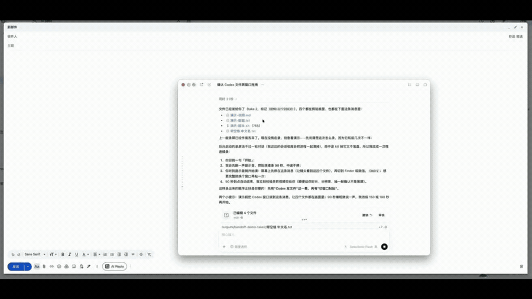

<h1 align="center">Porter · 文件摆渡</h1>

<p align="center">
  <strong>Move your work, not your folders.</strong><br>
  <sub>别再找目录，直接把文件带走。</sub>
</p>

<p align="center">
  <code>Codex → Porter → ⌘V</code>
</p>

---

Codex 已经把文件生成好了，但你还得打开 Finder、找到目录，再拖到微信、邮件或浏览器。

Porter 把这段路收成一句话：

```text
你：把 outputs 里那几个报告发给我
Codex：已打包并放进剪贴板，切到目标窗口 Cmd+V 即可。
```

⌘V。文件就过去了。

## Demo

<p align="center">
  
</p>

## Install

```bash
git clone https://github.com/edisontaisite/codex-plugins.git
cd codex-plugins

codex plugin marketplace add "$PWD"
codex plugin add porter@codex-plugins
```

重启 Codex 后生效。

## Usage

不用记工具名，直接说人话：

```text
把这几个文件给我
打个包我要发出去
在 Finder 里帮我选好，我自己拖
```

Porter 提供三个出口：

| Tool | What it does | Best for |
|---|---|---|
| `porter_zip` | 打包成 ZIP 并写入剪贴板 | ⭐ 默认，网页也收 |
| `porter_clipboard` | 原始文件直接写入剪贴板 | macOS 原生 App |
| `porter_reveal` | Finder 中打开并选中文件 | 网页要多个独立文件时 |

### 拿不准就用 `porter_zip`

单个文件是最大公约数，粘到哪儿都收，用户也少漏文件。

需要往网页里放**多个独立文件**时才换 `porter_reveal` —— 网页的粘贴通道
只收得到 1 个，拖拽通道才是完整的。原因见 [Limitations](#limitations)。

## How it works

Porter 不接管 Codex 的界面，也不试图让聊天里的文件链接变得可拖。
它换一条路：把 Codex 已经能访问的文件，转换成其他 App 能直接接收的形式。

```text
Codex ──▶ Porter ──▶ NSPasteboard ──▶ ⌘V ──▶ Finder / Mail / 微信 …
              │
              └────▶ open -R ──▶ Finder 已选中 ──▶ 拖进网页
```

写剪贴板时同时铺两个通道：`public.file-url`（每个文件一个 `NSPasteboardItem`，
Finder 和现代 App 读这个）和 `NSFilenamesPboardType`（老一些的 App 读这个）。
写完回读校验条目数，对不上直接报错 —— 交付工具静默丢文件比失败更糟。

`porter_zip` 的包落在 `$TMPDIR/codex-porter`，24 小时后自动清理，
不碰桌面和项目目录。需要留存时传 `dest_dir`。

## Limitations

**网页的粘贴通道只收 1 个文件。** 实测（ChatGPT 输入框）：同一份多文件剪贴板，
粘进原生 App 是完整的 6 个文件、文件名原样；粘进该网页只到 1 个，文件名变成 UUID。
这是浏览器侧的限制，不是剪贴板没写对 —— `public.file-url` 和 `NSFilenamesPboardType`
两个通道都验过是 6 条。

`porter_zip` 产出单个 ZIP，正好不触发这个限制（ChatGPT 输入框实测可用）。
网页确实需要多个独立文件时，走 `porter_reveal` + 拖拽 —— `DataTransfer`
通道的文件数和文件名是完整的。

> 各站点的上传实现不同，未逐一验证。遇到拒收 `.zip` 的站点，用 `porter_reveal`。

**会覆盖系统剪贴板。** `porter_zip` 和 `porter_clipboard` 都会。这是预期行为。

**仅支持 macOS。** 实现依赖 `NSPasteboard`、`ditto`、`open -R`。

## Requirements

- macOS
- Codex Desktop
- Node.js ≥ 16（优先使用 Codex 自带的 Node）
- 无第三方依赖

## Update

Codex 运行的是插件缓存中的副本，改完源码要重装：

```bash
codex plugin remove porter@codex-plugins
codex plugin add porter@codex-plugins
```

## Roadmap

探索方向，非承诺：

- [ ] 自动识别目标是原生 App 还是网页
- [ ] 更直接的 Drag & Drop
- [ ] Windows / Linux

## License

MIT © Edison
